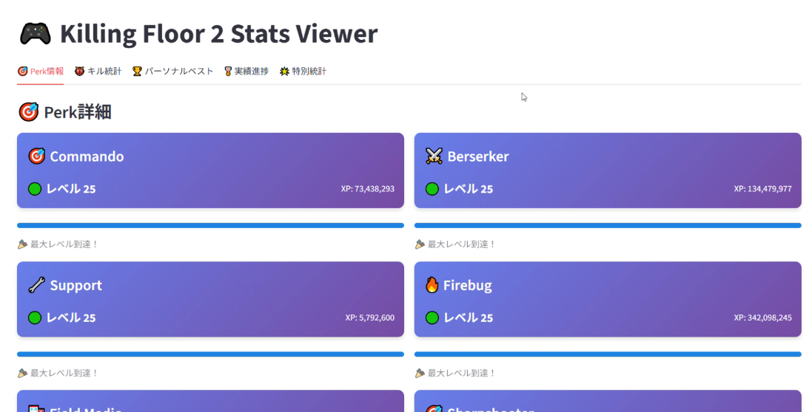
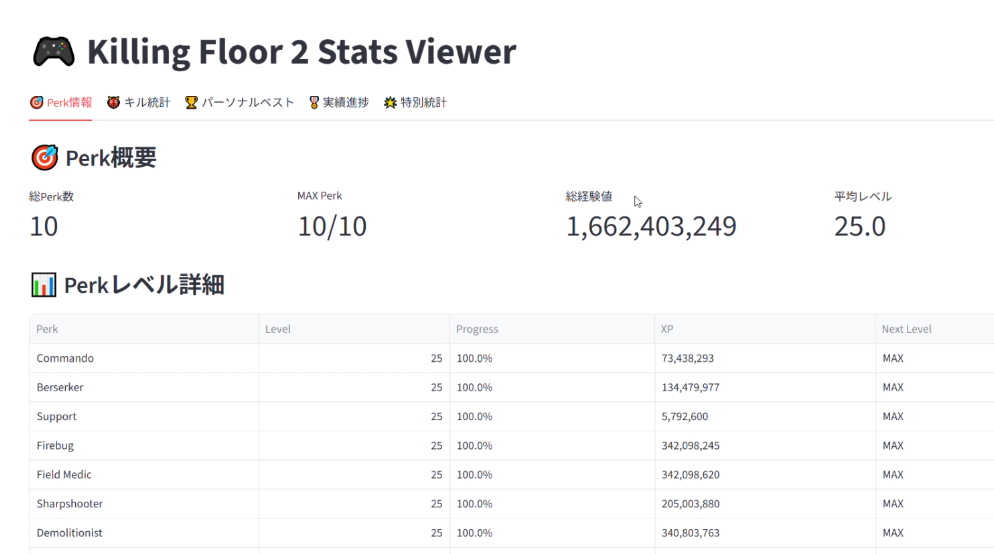

# kf2-status-viewer
Steam APIで取得できるKF2の統計情報を表示します。統計情報は合っているかわかりません。  
ClaudeとGeminiが作りました  
使用は自己責任でお願いします  

## 必要なもの
* Steam API キー
* StreamID64
    * https://steamid.io/ で自分のsteam user pageのURLを入力すると取得できます


## 手順

1. 起動する
    ```
    $ streamlit run simple.py (または colorful.py)
    ```

2. **Stream APIキー**を入力する

3. 自分の**StreamID64**を入力する

### colorful


### simple
